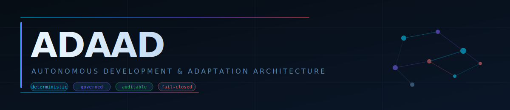
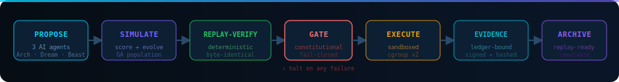

<p align="center">
  
</p>

<p align="center">
  <a href="https://github.com/InnovativeAI-adaad/ADAAD/actions/workflows/ci.yml">
    
  </a>
  &nbsp;
  
  
  
  
  &nbsp;
  
  
  
</p>

<br/>

<p align="center">
  <strong>AI agents that improve your codebase — constitutionally gated at every step.</strong>
</p>
<p align="center">
  ADAAD proposes mutations, scores them with a genetic algorithm, and applies only what passes<br/>
  deterministic replay verification + a 16-rule constitutional policy engine.<br/>
  <em>If anything fails, the pipeline halts. No exceptions. No workarounds.</em>
</p>

<br/>

<p align="center">
  <a href="#-start-in-60-seconds"><strong>Quick Start</strong></a> ·
  <a href="#how-the-loop-works"><strong>How It Works</strong></a> ·
  <a href="#-android-app--free"><strong>Android App</strong></a> ·
  <a href="#whats-active-v311-phase-61"><strong>Phase 6.1 Status</strong></a> ·
  <a href="docs/CONSTITUTION.md"><strong>Constitution</strong></a> ·
  <a href="ROADMAP.md"><strong>Roadmap</strong></a>
</p>

---

## What ADAAD does

Three Claude-powered AI agents continuously propose code improvements. Those proposals compete in a genetic-algorithm population — crossed, mutated, and ranked. The fittest candidates advance to a **constitutional gate**: 16 deterministic rules, evaluated in order. One blocking failure halts everything.

<p align="center">
  
</p>

After every epoch, scoring weights self-calibrate via momentum gradient descent. Mutation strategies that perform well gain influence. Underperformers decay. The system learns which kinds of improvements are worth making — without ever bypassing governance.

---

## Three agents. One loop.

<p align="center">
  
</p>

Each agent brings a distinct mutation philosophy to every epoch. Their proposals compete head-to-head inside the same governed pipeline — scored, cross-bred, and ranked. The **GovernanceGate** sees all of them equally.

> [!IMPORTANT]
> `GovernanceGate` is the **only** surface that can approve, sign, or execute a mutation. Market adapters, budget arbitrators, container profilers, and federation consensus all influence fitness scores — but **none of them hold approval authority**. That belongs exclusively to the constitutional evaluation. This is architecturally enforced, not just documented.

---

## ⚡ Start in 60 seconds

```bash
git clone https://github.com/InnovativeAI-adaad/ADAAD.git
cd ADAAD
python onboard.py
```

> **Requirements:** Python 3.11.9 · pip · git

`onboard.py` handles everything: environment setup, workspace init, schema validation, and a governed dry-run. Every step is idempotent — safe to re-run at any time.

<details>
<summary><strong>What onboarding does, step by step</strong></summary>

<br/>

```
onboard.py
  │
  ├─ 1. Verify Python 3.11.9
  ├─ 2. Create .venv + install dependencies
  ├─ 3. Set ADAAD_ENV=dev  (safe default)
  ├─ 4. Initialize workspace  (nexus_setup.py)
  ├─ 5. Validate governance schemas
  ├─ 6. Run governed dry-run
  │      python -m app.main --dry-run --replay audit
  └─ 7. Print your personalized next steps
```

Successful output:

```
✔ Python 3.11.9
✔ Virtual environment ready
✔ Dependencies installed
✔ ADAAD_ENV=dev
✔ Workspace initialized
✔ Governance schemas valid
✔ Dry-run complete — no files modified

━━━━━━━━━━━━━━━━━━━━━━━━━━━━━━━━━━
  ADAAD is ready.

  Run the dashboard:   python server.py
  Run an epoch:        python -m app.main --verbose
  Explore the docs:    docs/README.md
━━━━━━━━━━━━━━━━━━━━━━━━━━━━━━━━━━
```

</details>

---

## How the loop works

```python
from runtime.autonomy.ai_mutation_proposer import CodebaseContext
from runtime.evolution.evolution_loop import EvolutionLoop
import os

loop = EvolutionLoop(
    api_key=os.environ["ADAAD_CLAUDE_API_KEY"],
    generations=3,
)

context = CodebaseContext(
    file_summaries={"runtime/autonomy/mutation_scaffold.py": "Scoring engine."},
    recent_failures=[],
    current_epoch_id="epoch-001",
)

result = loop.run_epoch(context)

print(f"Proposals:   {result.total_candidates}")
print(f"Accepted:    {result.accepted_count}")
print(f"Next agent:  {result.recommended_next_agent}")
print(f"Accuracy:    {result.weight_accuracy:.1%}")
print(f"Duration:    {result.duration_seconds:.1f}s")
```

> [!NOTE]
> Replay mode is always on. Every decision above can be re-run with `--replay audit` to verify byte-identical outputs. Divergence from the original run halts the pipeline and logs the exact delta.

---

## Platform capabilities

<table>
<tr>
  <td><strong>🔁&nbsp; Deterministic Replay</strong></td>
  <td>Every decision re-runs byte-identical. Divergence halts the pipeline and is logged in the evidence ledger.</td>
</tr>
<tr>
  <td><strong>🛡️&nbsp; Constitutional Gating</strong></td>
  <td>16 governance rules evaluated per mutation across three tiers (Sandbox / Stable / Production). One blocking failure = full halt.</td>
</tr>
<tr>
  <td><strong>🧾&nbsp; Append-Only Evidence Ledger</strong></td>
  <td>Every governed step is SHA-256 hash-chained, signed, and permanently attached. No retroactive modification possible.</td>
</tr>
<tr>
  <td><strong>🤖&nbsp; AI Mutation Proposals</strong></td>
  <td>Three Claude-powered agents (Architect / Dream / Beast) produce diverse, scored candidates each epoch via the Anthropic API.</td>
</tr>
<tr>
  <td><strong>📈&nbsp; Self-Calibrating Weights</strong></td>
  <td>Scoring weights adapt via momentum gradient descent across epochs. Underperforming strategies decay automatically.</td>
</tr>
<tr>
  <td><strong>🧬&nbsp; Genetic Population Evolution</strong></td>
  <td>BLX-alpha crossover, elite preservation, and diversity enforcement per generation. UCB1 bandit selects agent strategy.</td>
</tr>
<tr>
  <td><strong>🗺️&nbsp; Fitness Landscape Memory</strong></td>
  <td>Win/loss rates tracked per mutation type. Plateau detection triggers exploration mode via Thompson sampling.</td>
</tr>
<tr>
  <td><strong>🧪&nbsp; Policy Simulation</strong></td>
  <td>Replay historical epochs under hypothetical constraints — zero side-effects, full audit trail.</td>
</tr>
<tr>
  <td><strong>🐳&nbsp; Container Isolation</strong></td>
  <td>cgroup v2 sandboxes — pool-managed, health-probed, lifecycle-audited. Resource bounds are a blocking constitutional rule.</td>
</tr>
<tr>
  <td><strong>🌐&nbsp; Multi-Node Federation</strong></td>
  <td>Cross-repo mutations with dual-gate constitutional enforcement. Divergence in any node blocks promotion. (v3.0.0)</td>
</tr>
<tr>
  <td><strong>📝&nbsp; Roadmap Self-Amendment</strong></td>
  <td>The engine proposes changes to its own roadmap. Humans approve. No auto-merge path exists — by constitutional invariant. (v3.1.0-dev)</td>
</tr>
</table>

---

## What's active: v3.1.1 (Phase 6.1)

**Phase 6 — Autonomous Roadmap Self-Amendment** is complete (`v3.1.0`). All milestones shipped and governed.

| Milestone | Status | Module |
|:---|:---:|:---|
| M6-01 `RoadmapAmendmentEngine` | ✅ shipped | `runtime/autonomy/roadmap_amendment_engine.py` |
| M6-02 `ProposalDiffRenderer` | ✅ shipped | `runtime/autonomy/proposal_diff_renderer.py` |
| M6-03 EvolutionLoop wire | ✅ shipped | `runtime/evolution/evolution_loop.py` |
| M6-04 Federated propagation | ✅ shipped | `runtime/governance/federation/mutation_broker.py` |
| M6-05 Android distribution | ✅ shipped | `.github/workflows/android-free-release.yml` |

**Phase 6.1 — Simplification Contract Enforcement** is the active lane (`v3.1.1`). Complexity budgets are now CI-enforced; legacy branch count is fail-closed at ≤ 6.

| Target | Baseline | Enforced Cap | CI Gate | Status |
|:---|:---:|:---:|:---|:---:|
| Legacy branch count | 23 | ≤ 6 | `simplification-contract-gate` | ✅ |
| `runtime/constitution.py` max lines | 2200 | 2100 | `simplification-contract-gate` | ✅ |
| `app/main.py` max lines | 1200 | 800 | `simplification-contract-gate` | ✅ |
| `security/cryovant.py` max fan-in | 6 | 5 | `simplification-contract-gate` | ✅ |
| Metrics-schema producer coverage | — | 100% | `simplification-contract-gate` | ✅ |

> [!TIP]
> **Constitutional principle:** ADAAD proposes. Humans approve. The roadmap never self-promotes without a human governor sign-off recorded in the governance ledger. This cannot be delegated or automated.

<details>
<summary><strong>Full phase history</strong></summary>

<br/>

| Version | Phase | What shipped |
|:---|:---:|:---|
| **v3.1.1** | 6.1 | Simplification Contract Enforcement · Legacy reduction (23→6) · CI budget gates |
| **v3.1.0** | 6 | Roadmap Self-Amendment · ArchitectAgent Spec v3.1.0 · Free Android Distribution |
| **v3.0.0** | 5 | Multi-Repo Federation — dual-gate, `FederatedEvidenceMatrix`, HMAC key registry |
| **v2.3.0** | 4 | AST-aware semantic scoring (`SemanticDiffEngine`) + pipeline fast-path primitives |
| **v2.2.0** | 4 | `MutationRouteOptimizer`, `EntropyFastGate`, `ParallelGovernanceGate` |
| **v2.1.0** | 3 | Adaptive penalty weights · Thompson sampling · `WeightAdaptor` Phase 2 |
| **v2.0.0** | 2 | AI mutation engine · UCB1 bandit · epoch telemetry · MCP pipeline tools |
| v1.8 | — | Market × federation × container × Darwinian unified |
| v1.7 | — | Fully autonomous multi-node federation — Raft consensus, gossip |
| v1.6 | — | Real container-level isolation — cgroup v2, orchestrator, health probes |
| v1.0 | — | Stable release — HMAC, 11 constitutional rules, MCP co-pilot |

</details>

---

## 📲 Android App — Free

> No Play Store account required. No fee. Installs like any normal app.

<table>
<tr>
<td width="50%" valign="top">

**⚡ Fastest — Direct APK**

1. Open the [**Releases page →**](../../releases/latest)
2. Tap `adaad-community-*.apk` to download
3. Tap the download → **Install**
4. If prompted: *Allow from this source* → Install

</td>
<td width="50%" valign="top">

**🏆 Recommended — Obtainium (auto-updates)**

1. Install [Obtainium](https://github.com/ImranR98/Obtainium/releases)
2. Tap **+** → paste `github.com/InnovativeAI-adaad/ADAAD`
3. Tap **Save** → **Install**
4. Updates install automatically

</td>
</tr>
<tr>
<td valign="top">

**🌐 No download — Web App (PWA)**

1. Open Chrome on Android
2. Visit `https://innovativeai-adaad.github.io/ADAAD/`
3. ⋮ → **Add to Home screen** → Add

</td>
<td valign="top">

**📦 F-Droid (reproducible builds)**

1. F-Droid → Settings → Repositories → **+**
2. Paste `https://innovativeai-adaad.github.io/adaad-fdroid/repo`
3. Refresh → search *ADAAD* → Install

</td>
</tr>
</table>

📱 **On your phone right now?** → [**One-tap install page**](https://innovativeai-adaad.github.io/ADAAD/install) has QR codes for every method.

🔐 **Verify APK integrity:** `apksigner verify --print-certs adaad-community-*.apk`

> Android 8.0+ · Full guide: [INSTALL_ANDROID.md](INSTALL_ANDROID.md) · Launch playbook: [DISTRIBUTION.md](DISTRIBUTION.md)

---

## Configuration

| Variable | Purpose | Required |
|:---|:---|:---:|
| `ADAAD_ENV` | Environment mode. Unknown values halt at boot. | ✅ Always |
| `ADAAD_CLAUDE_API_KEY` | Anthropic API key for AI mutation proposals. | AI mode |
| `ADAAD_GOVERNANCE_SESSION_SIGNING_KEY` | HMAC signing key. Required in strict environments. | Production |
| `ADAAD_AMENDMENT_TRIGGER_INTERVAL` | Epochs between roadmap amendment evaluations. Default: `10`. | Phase 6 |
| `ADAAD_FEDERATION_HMAC_KEY` | Key material for federated mutation transport. Absent = fail-closed. | Federation |
| `CRYOVANT_DEV_MODE` | Enables dev-only overrides. Rejected in strict environments. | No |

Full reference: [docs/ENVIRONMENT_VARIABLES.md](docs/ENVIRONMENT_VARIABLES.md)

---

## Where to go next

<table>
<tr>
  <td>🚀 <strong>Try it in 60 seconds</strong></td>
  <td><code>python onboard.py</code></td>
</tr>
<tr>
  <td>📱 <strong>Install on Android</strong></td>
  <td><a href="INSTALL_ANDROID.md">INSTALL_ANDROID.md</a></td>
</tr>
<tr>
  <td>🏗️ <strong>Understand the architecture</strong></td>
  <td><a href="docs/EVOLUTION_ARCHITECTURE.md">docs/EVOLUTION_ARCHITECTURE.md</a></td>
</tr>
<tr>
  <td>📜 <strong>Read the governance constitution</strong></td>
  <td><a href="docs/CONSTITUTION.md">docs/CONSTITUTION.md</a></td>
</tr>
<tr>
  <td>📐 <strong>Review the canonical spec</strong></td>
  <td><a href="docs/governance/ARCHITECT_SPEC_v3.1.0.md">docs/governance/ARCHITECT_SPEC_v3.1.0.md</a></td>
</tr>
<tr>
  <td>🤝 <strong>Contribute code</strong></td>
  <td><a href="CONTRIBUTING.md">CONTRIBUTING.md</a></td>
</tr>
<tr>
  <td>🔍 <strong>Audit a release</strong></td>
  <td><a href="docs/comms/claims_evidence_matrix.md">docs/comms/claims_evidence_matrix.md</a></td>
</tr>
<tr>
  <td>🔒 <strong>Review the security posture</strong></td>
  <td><a href="docs/SECURITY.md">docs/SECURITY.md</a></td>
</tr>
<tr>
  <td>🚢 <strong>Deploy to production</strong></td>
  <td><a href="docs/release/release_checklist.md">docs/release/release_checklist.md</a></td>
</tr>
</table>

---

## Non-goals

> [!WARNING]
> ADAAD does **not** replace human judgment · guarantee semantic correctness · remove required oversight · operate without an audit trail.
>
> The pipeline is designed to augment human decision-making, not circumvent it. Every approval gate that requires a human governor cannot be delegated to automation — by design, not by convention.

---

<!-- ADAAD_VERSION_INFOBOX:START -->
<!-- Auto-generated by scripts/sync_docs_on_merge.py — do not edit manually -->
<!-- Sync context: generated from current git metadata at sync time; reflects last sync context only, not arbitrary local working trees. -->

| Field | Value |
|:---|:---|
| **Current version** | `3.1.1` |
| **Released** | 2026-03-07 |
| **Release SHA** | `a205ca4` |
| **Release Branch** | `main` |

**New in this release:** Phase 6.1 — Simplification Contract Enforcement · Legacy branch reduction (23→6, CI-enforced) · Critical file complexity budgets tightened

<!-- ADAAD_VERSION_INFOBOX:END -->

---

<p align="center">
  <a href="docs/governance/ARCHITECT_SPEC_v3.1.0.md">Spec v3.1.0</a> ·
  <a href="docs/CONSTITUTION.md">Constitution</a> ·
  <a href="docs/EVOLUTION_ARCHITECTURE.md">Architecture</a> ·
  <a href="ROADMAP.md">Roadmap</a> ·
  <a href="CHANGELOG.md">Changelog</a> ·
  <a href="INSTALL_ANDROID.md">Android</a> ·
  <a href="CONTRIBUTING.md">Contributing</a> ·
  <a href="docs/SECURITY.md">Security</a>
</p>

<p align="center">
  <sub>MIT License · <a href="LICENSE">LICENSE</a></sub>
</p>
