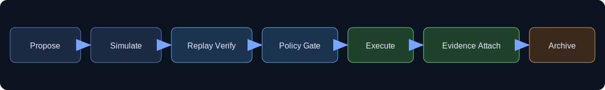

# ADAAD 

> Deterministic, policy-governed autonomous code evolution.
> ADAAD enforces constitutional mutation gates, deterministic replay checks, and fail-closed execution behavior.
> It is built for governed staging and audit workflows.

ADAAD is a governance layer for autonomous code mutation. It exists to ensure autonomy remains reproducible, auditable, and constrained by constitutional policy.

<p align="center">
  
</p>

<p align="center">
  <a href="https://github.com/InnovativeAI-adaad/ADAAD/actions/workflows/ci.yml"></a>
  <a href="QUICKSTART.md"></a>
  
  <a href="LICENSE"></a>
  
</p>

<p align="center">
  
  
  
  
</p>

<p align="center">
  <a href="QUICKSTART.md"><strong>Get Started →</strong></a> ·
  <a href="docs/README.md"><strong>Documentation</strong></a> ·
  <a href="examples/single-agent-loop/README.md"><strong>Examples</strong></a> ·
  <a href="https://github.com/InnovativeAI-adaad/ADAAD/issues"><strong>Issues</strong></a>
</p>

<p align="center">
  
</p>

## ✨ Platform Highlights

| Capability | Why it matters |
| --- | --- |
| 🔁 Deterministic replay verification | Re-runs produce auditable, reproducible governance decisions. |
| 🛡️ Fail-closed constitutional gating | Mutations halt automatically when policy/replay/evidence constraints fail. |
| 🧾 Ledger-anchored evidence | Every governed step can be traced to durable artifacts for audit and review. |
| 🚦 Release evidence gates | Public-readiness milestones require objective evidence completion before release. |

## 🎬 Operator Journey (at a glance)

```text
Discover candidate → Simulate safely → Replay-verify outcomes → Enforce constitutional policy
        ↓                    ↓                     ↓                              ↓
    Evidence capture → Lineage append → Governance decision → Stage for governed review
```

<details>
<summary><strong>Open fast-path links</strong></summary>

- ⚡ First run in minutes: [QUICKSTART.md](QUICKSTART.md)
- 🧪 End-to-end sample: [examples/single-agent-loop/README.md](examples/single-agent-loop/README.md)
- 📚 Canonical docs hub: [docs/README.md](docs/README.md)
- 🛡️ Security + disclosure: [docs/SECURITY.md](docs/SECURITY.md)

</details>


## ❤️ Built for humans operating high-stakes autonomy

ADAAD is designed to be technically strict **and** operator-friendly.

### Choose your path

| If you are... | Start here | Outcome |
| --- | --- | --- |
| 🧪 First-time evaluator | [QUICKSTART.md](QUICKSTART.md) | Get a governed run in minutes. |
| 👩‍💻 Contributor | [docs/ARCHITECTURE_CONTRACT.md](docs/ARCHITECTURE_CONTRACT.md) + [docs/README.md](docs/README.md) | Change code without breaking governance boundaries. |
| 🔐 Security reviewer | [docs/SECURITY.md](docs/SECURITY.md) + [docs/governance/SECURITY_INVARIANTS_MATRIX.md](docs/governance/SECURITY_INVARIANTS_MATRIX.md) | Validate auth/signing and fail-closed controls. |
| 🧾 Auditor / release owner | [docs/releases/RELEASE_AUDIT_CHECKLIST.md](docs/releases/RELEASE_AUDIT_CHECKLIST.md) + [docs/RELEASE_EVIDENCE_MATRIX.md](docs/RELEASE_EVIDENCE_MATRIX.md) | Verify evidence completeness and release readiness. |

### Operator promises

- Clear fail-closed behavior over silent success.
- Replay-verifiable decisions over opaque automation.
- Evidence-first workflows over hand-wavy “it works on my machine.”
- Explicit contracts (architecture, determinism, auth) for safer collaboration.

## Why ADAAD Exists

Unconstrained autonomous mutation introduces systemic risk.

> ⚖️ Autonomy without governance becomes non-deterministic risk.  
> **ADAAD scales controlled, replay-verifiable evolution.**

<p align="center">
  
  
  
</p>

| Without Governance | With ADAAD |
|---|---|
| Non-deterministic mutation | Deterministic replay validation |
| Unbounded autonomy | Constitutional policy gating |
| Opaque changes | Ledger-anchored evidence |
| Silent drift | Fail-closed enforcement |

ADAAD treats mutation as a governed, evidence-bound lifecycle—not a blind rewrite.

---

ADAAD ensures autonomy remains:
- Deterministic
- Governed
- Auditable
- Replay-verifiable
- Fail-closed

## Fail-Closed by Design

If replay diverges, policy fails, or evidence cannot be attached, mutation execution halts.

No mutation executes without governance validation.

## What ADAAD Does

ADAAD orchestrates a governed mutation lifecycle:

1. Propose candidate mutation.
2. Simulate in policy-bounded runtime.
3. Replay-verify expected state transition.
4. Enforce constitutional and governance gates.
5. Execute only when all required controls pass.
6. Attach evidence and lineage artifacts.
7. Archive decisions for audit and reproducibility.

## Trust Guarantees

ADAAD enforces:

- Deterministic replay validation
- Fail-closed mutation execution
- Policy-bound runtime enforcement
- Lineage and mutation traceability
- Constitution-level governance constraints

All governance decisions are reproducible across runs.

## Non-Goals

ADAAD does not:
- Generate model intelligence
- Replace CI pipelines
- Remove human oversight where required
- Guarantee semantic correctness beyond governed constraints

## Unified Server Hardening (2026 Update)

Recent improvements to `server.py` and dashboard integration:

- Added first-class real-time WebSocket stream at `/ws/events` with a stable frame contract (`hello` + `event_batch`).
- Hardened API topology for operators with production endpoints for mutations, epochs, constitution status, and system intelligence.
- Proposal intake endpoint `/api/mutations/proposals` now delegates to MCP validator + queue for governance-consistent submission.
- Health payload now includes ADAAD version and runtime profile lock visibility to improve operator confidence.
- UI mocks are disabled by default and can be enabled only via `ADAAD_UI_MOCKS=1` for local/demo usage.

### Key Unified API Endpoints

- `GET /api/health`
- `GET /api/mutations`
- `GET /api/epochs`
- `GET /api/constitution/status`
- `GET /api/system/intelligence`
- `POST /api/mutations/proposals`
- `GET /api/audit/epochs/{epoch_id}/replay-proof`
- `GET /api/audit/epochs/{epoch_id}/lineage`
- `GET /api/audit/bundles/{bundle_id}`
- `WS /ws/events`

## Quick Start

- Follow [QUICKSTART.md](QUICKSTART.md) for environment setup and validation.
- Run `./quickstart.sh` to execute baseline checks.
- Run `python -m app.main --dry-run --replay audit --verbose` for a governed dry-run.

## Dependency Baseline (Production)

- `requirements.server.txt` is the source of truth for production/runtime dependency versions.
- `archives/backend/requirements.txt` mirrors the same pinned `fastapi`, `uvicorn`, and `anthropic` versions to preserve archive reproducibility against the active runtime baseline.
- Run `python scripts/check_dependency_baseline.py` to enforce this mirror invariant before merge/release (works from any current working directory and fails if tracked packages are unpinned or divergent).

## Strategic Documentation Path

- Canonical docs home: [docs/README.md](docs/README.md)

### Governance and Determinism
- [Determinism contract](docs/DETERMINISM.md)
- [Architecture contract](docs/ARCHITECTURE_CONTRACT.md)
- [One-page architecture summary](docs/ARCHITECTURE_SUMMARY.md)
- [Threat model](docs/THREAT_MODEL.md)
- [Governance maturity model](docs/GOVERNANCE_MATURITY_MODEL.md)

### Release and Compliance
- [Release evidence matrix](docs/RELEASE_EVIDENCE_MATRIX.md)
- [Release audit checklist](docs/releases/RELEASE_AUDIT_CHECKLIST.md)

## Project Status

| Aspect | Status |
|---|---|
| Recommended for | Governed audit workflows, replay verification, staged mutation review |
| Not ready for | Unattended production autonomy |
| Maturity | Stable / v1.0 |
| Replay mode | Audit and strict governance-ready |
| Mutation execution | Fail-closed and policy-gated |


## Start here next

See role-based paths in [docs/README.md](docs/README.md) and pick the route that matches your current role (new user, contributor, or governance reviewer).


## Governance & Determinism Guarantees (Current State)

ADAAD currently guarantees:

- Deterministic constitutional envelope hashing
- Replay-stable governance evaluation
- Canonicalized Aponi integration port
- Configurable and ledger-visible dispatcher latency
- YAML hermetic fallback for constitution loading

ADAAD does **not** yet implement:

- Live market signal adapters
- True Darwinian agent budget competition
- Real container-level isolation backend
- Fully autonomous multi-node federation

### Environment Configuration

| Variable | Purpose |
| --- | --- |
| `ADAAD_DISPATCH_LATENCY_BUDGET_MS` | Dispatcher latency budget |
| `ADAAD_DISPATCH_LATENCY_MODE` | Dispatcher latency mode (`static`/`adaptive`) |
| `ADAAD_DETERMINISTIC_LOCK` | Freeze deterministic runtime behavior |
| `ADAAD_CONSTITUTION_STRICT` | Strict constitution enforcement mode |


## Security and determinism enforcement updates

- Payload-bound legacy static signatures (`cryovant-static-*`) are now accepted only in explicit dev mode (`ADAAD_ENV=dev` + `CRYOVANT_DEV_MODE`).
- Governance token verification paths use production-capable deterministic token verification (`verify_governance_token`) instead of deprecated session-helper semantics.
- Governance certification now binds `token_ok` into certification pass/fail decisions.
- Deterministic-provider enforcement explicitly covers governance-critical recovery tiers (`governance`, `critical`) while retaining `audit` alias compatibility.
- Recovery tier auto-application now enforces explicit escalation/de-escalation semantics with recovery-window gating.

See also: `docs/governance/SECURITY_INVARIANTS_MATRIX.md` and `docs/governance/DETERMINISM_CONTRACT_SPEC.md`.
