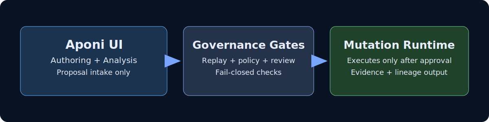

# Metal (ui)

The Aponi dashboard provides HTTP endpoints for orchestrator state, metrics tailing, lineage entries, and mutation history. It should be started after core checks succeed and must surface health signals without external dependencies.

  

<em>Aponi context: operator-facing proposal tooling that remains bounded by ADAAD governance authority.</em>

## User interface standard

The dashboard serves a human-readable default interface at `/` (also `/index.html`).
This page is the standard entry point for users and renders live data from read-only governance APIs:

- `/state`
- `/system/intelligence`
- `/risk/summary`
- `/risk/instability`
- `/metrics/review-quality` (deterministic review latency and SLA coverage summary over a bounded metrics window)
- `/policy/simulate`
- `/alerts/evaluate`
- `/evolution/timeline`
- `/replay/divergence`
- `/replay/diff?epoch_id=...`
- `/evidence/{bundle_id}` (bearer-auth gated evidence bundle envelope)

## Incremental Aponi V2 path

Aponi now follows an incremental control-plane-first path inside the current server boundary:

1. Observability intelligence (`/system/intelligence`)
2. Evolution timeline (`/evolution/timeline`)
3. Replay forensics (evidence-bundle exports)
4. Risk intelligence (`/risk/summary`)
5. Governance command surface (planned, strict-gated)

## Governance command surface (strict-gated)

Aponi now includes a deterministic governance command queue for operator-issued intents.

- `GET /control/free-sources` — lists approved free capability sources from `data/free_capability_sources.json`.
- `GET /control/queue` — read-only view of the latest queued command intents.
- `GET /control/skill-profiles` — exposes governed raw skill profiles (knowledge domains, allowed abilities, allowed capability sources).
- `GET /control/capability-matrix` — exposes normalized skill→knowledge/ability/capability compatibility for deterministic UI population.
- `GET /control/policy-summary` — returns control-plane validation envelope (limits, profiles, source inventory).
- `GET /control/templates` — returns deterministic command-intent templates per governed skill profile.
- `GET /control/environment-health` — returns deterministic runtime readiness diagnostics for control-plane dependencies, including schema-version compatibility checks.
- `POST /control/queue` — queues a governance command intent (disabled unless `APONI_COMMAND_SURFACE=1`).
- `GET /control/queue/verify` — verifies queue continuity (`queue_index`, `command_id`, `previous_digest` chain) and flags malformed payload records.

Supported command intent types:

- `create_agent`
- `run_task`

Validation invariants:

- `governance_profile` must be `strict` or `high-assurance`.
- `agent_id` must match deterministic slug constraints.
- `skill_profile` must be from `data/governed_skill_profiles.json`.
- `capabilities` must be from `data/free_capability_sources.json` and permitted by selected `skill_profile`.
- `knowledge_domain` must be allowed by selected `skill_profile`.
- `create_agent` requires `purpose`; `run_task` requires both `task` and `ability` (ability must be allowed by selected `skill_profile`).
- `capabilities` are deduplicated deterministically and capped by `CONTROL_CAPABILITIES_MAX`.
- Text fields are normalized and size-bounded before queue persistence to reduce malformed payload drift.
- Queue entries include deterministic `previous_digest` continuity and can be validated via `/control/queue/verify`.

This surface queues intents only and does not directly execute mutations.

Replay forensics is now available as deterministic read-only projection endpoints.

Replay inspector UI components now live under `ui/aponi/` and are loaded by the default dashboard page:

- `ui/aponi/replay_inspector.js` renders a constrained-device-safe replay panel.
- The panel fetches `/replay/divergence` plus `/replay/diff?epoch_id=...` with timeout-guarded requests.
- It includes last-N epoch navigation, semantic divergence highlighting, and mutation-to-lineage drill-down using `lineage_chain.mutations` data.
- Loading/error states are explicit and compact for Android and low-resource operation.

`/replay/diff` now also includes a deterministic `lineage_chain` payload with per-mutation ancestry fields (`mutation_id`, `parent_mutation_id`, `ancestor_chain`, `certified_signature`) to support in-UI lineage inspection.
`/replay/diff` includes a `semantic_drift` section with stable class counts and per-key class assignment across
`config_drift`, `governance_drift`, `trait_drift`, `runtime_artifact_drift`, and `uncategorized_drift`.

Current implementation is replay-neutral and deterministic. Forensic endpoints now return `bundle_id` + `export_metadata` and write immutable forensic exports in `reports/forensics/` using canonical JSON ordering.

Dashboard risk and replay classifiers now use canonical governance event types resolved via `runtime/governance/event_taxonomy.py`. Legacy metric event strings remain supported through a strict fallback map for backward compatibility.

`/risk/instability` provides a deterministic weighted instability index for early-warning governance posture analysis, with explicit input and weight disclosure for auditability, plus additive momentum fields (`instability_velocity`, `instability_acceleration`), confidence interval bounds, and velocity-spike anomaly flags (absolute velocity deltas).
`/policy/simulate` offers read-only policy comparison using candidate governance policy artifacts and current telemetry inputs.
`/alerts/evaluate` returns deterministic severity-bucketed governance alerts for operator routing and escalation.

Policy thresholds and model metadata are sourced from `governance/governance_policy_v1.json` via deterministic runtime validation at startup. The `/system/intelligence` payload includes a `policy_fingerprint` field for audit trails.

## Optional MCP utility surface (`--serve-mcp`)

When launching `ui/aponi_dashboard.py` in standalone mode, `--serve-mcp` enables three MCP mutation utility routes:

- `POST /mutation/analyze`
- `POST /mutation/explain-rejection`
- `POST /mutation/rank`

Safety invariants for this mode:

- These routes are disabled unless `--serve-mcp` is explicitly passed.
- JWT authentication is enforced for the three MCP routes when enabled (`Authorization: Bearer <token>`).
- Existing dashboard routes keep their prior behavior when `--serve-mcp` is not set.

## Browser hardening

Aponi HTML responses are sent with `Cache-Control: no-store` and a restrictive CSP.
The UI script is served from `/ui/aponi.js` to keep the page compatible with non-inline script policy.

## Enhanced static dashboard

An optional enhanced dashboard is available at `ui/enhanced/enhanced_dashboard.html` for read-only live visibility over existing Aponi APIs.

## Floating observation + command initiator

The default Aponi UI now includes a draggable floating panel that acts as a durable operator cockpit:

- Observes live command queue state (`/control/queue`)
- Loads governed compatibility matrix (`/control/capability-matrix`) to auto-populate skill profiles, knowledge domains, abilities, and capability defaults
- Submits governed command intents (`create_agent` / `run_task`) through `POST /control/queue`
- Persists collapse/position state in browser local storage for session continuity
- Surfaces capability-matrix load failures and empty profile inventories in the panel status area so operators can distinguish degraded configuration from valid empty inputs
- Performs a client-side required-field guard for `agent_id` before queue submission to reduce avoidable rejected intents

Safety posture remains unchanged:

- Intelligence endpoints remain read-only
- Command intent submission is strict-gated (`APONI_COMMAND_SURFACE=1`)
- Queueing an intent does not execute mutation directly

Schema versioning: `data/free_capability_sources.json` and `data/governed_skill_profiles.json` include top-level `_schema_version` for forward-compatible governance artifact evolution. Runtime health now reports compatibility against expected schema version.

Aponi governance intelligence responses are validated against draft-2020-12 schemas in `schemas/aponi_responses/`; validation failures return structured `governance_error: "response_schema_violation"` fail-closed responses.

## Canonical Aponi configuration

- Aponi URL is derived from runtime constants (`runtime/constants.py`).
- Hardcoded dashboard/sync port defaults are not allowed.
- Federation support in this UI layer remains baseline and is not presented as hardened multi-node transport.

For ADAAD-9 editor preflight, lint previews should be generated through `runtime/mcp/linting_bridge.py` so annotations remain deterministic and aligned with governed MCP analysis semantics.

## Governed mutation proposal editor (default production UI)

`ui/aponi/index.html` is the default production dashboard source served by `server.py`.

The editor collects:

- `target path`
- `agent_id`
- metadata (JSON object)
- Python mutation content

Submission behavior:

- Primary governed endpoint: `POST /api/mutations/proposals`
- Compatibility fallback: `POST /mutation/propose`
- Preview endpoint: `GET /api/lint/preview` (debounced editor lint preview; advisory only)

Authority boundary invariants:

- The UI is proposal authoring only and does **not** grant mutation execution authority.
- Proposal queue admission remains subject to constitutional policy checks, tier escalation controls, and human/governor review gates.

Editor submission lineage emits `aponi_editor_proposal_submitted.v1` for editor-origin proposal intents to strengthen audit traceability without changing authority boundaries.

## Editor proposal submission traceability event

For proposal submissions that originate from the Aponi editor UI, the server emits `aponi_editor_proposal_submitted.v1` on successful `POST /api/mutations/proposals` intake.

Expected traceability fields in the emitted payload are:

- `proposal_id`
- `session_id`
- `actor_context` (`actor_id`, `actor_role`, `authn_scheme`)
- `timestamp`
- `endpoint_path`
- `source` (`aponi_editor_ui`)

This event intentionally excludes mutation request body fields so UI-linked telemetry preserves governance traceability without leaking sensitive proposal content.
